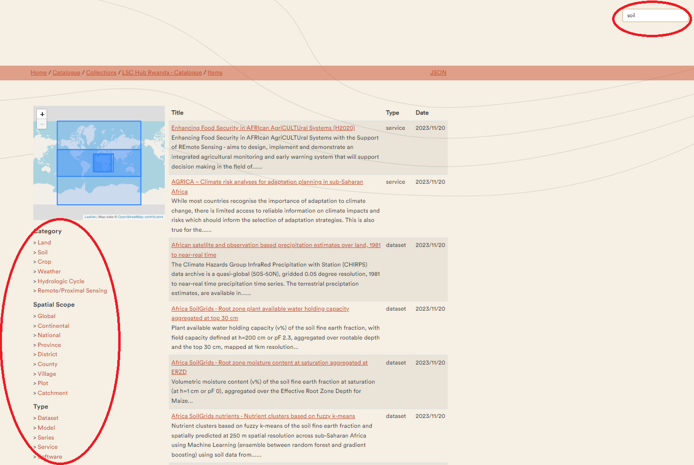
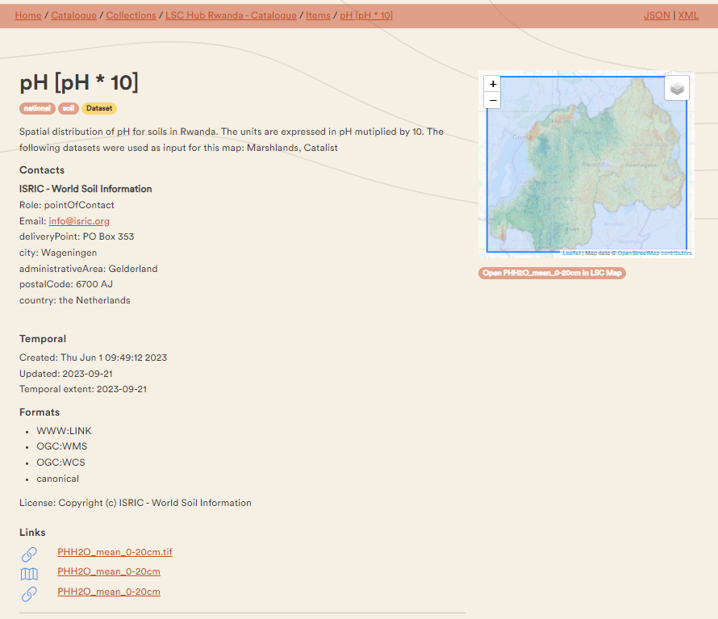

This document is a guideline for the components of a LSC Hub.

A typical LSC hub consists of 3 components:

- A [homepage](#homepage) providing a user welcome, project attribution and documentation; 
- A [catalogue](#catalogue) which provides a search interface on the resources relevant to the hub;
- A [map viewer](#map-viewer) section for easy access to data.

Moreover, there are 2 services important for the LSC hub:
- Providing [feedback](#feedback) to improve the LSC-hub
- Providing [Additional information](#additionalinformation) to enrich the LSC-hub.

## Homepage

The entry point of the hub is a webpage with general information about the project.
The LSC-hub for Rwanda can be accessed at https://lsc-hubs.org/hubs/rwanda/.

When arriving on the homepage, you can see 6 sections:
- **Data** to find data in the [catalogue](https://rwanda.lsc-hubs.org/) or go to the [mapviewer](https://maps.lsc-hubs.org/#lsc-rwanda)
- **Predictive modelling** to find modelling software in the [hub catalogue](https://rwanda.lsc-hubs.org/collections/metadata:main/items?type=model).
- **Policy** Which [policies](https://lsc-hubs.org/hubs/rwanda/policy/) are relevant to the hub, and can the hub support policy development?
- **Information Services** to find [agricultural knowledge and innovation systems](https://lsc-hubs.org/hubs/rwanda/akis/) in Rwanda
- **Use Cases** to explore the [use cases](https://lsc-hubs.org/hubs/rwanda/usecases/) of the LSC hub
- **Hub community** to find other users in the [stakeholder list](https://lsc-hubs.org/hubs/rwanda/stakeholders/)

**Exercise 1:** Explore the homepage of the LSC hub. Click on the links, and explore which info is in there.

## Catalogue

The central catalogue contains references to all relevant resources in the hub. 
The catalogue of Rwanda can be reached by clicking under _DATA_ on _Catalogue_ or directly by https://rwanda.lsc-hubs.org/ 

When you click on submit, the available records will appear.

Resources are categorised into:

- Datasets
- Software 
- Model
- Services (Web services, APIs, SMS, phone and onsite services)

The catalogue allows the filtering of keywords. The 3 main keywords are: 
1. category ( _such as soil, crop, etc._),
2. spatial scope (_such as Global, National, district, etc._ ),
3. the type (_such as dataset, software, etc_).

Second, any other keyword linked to the resource can be used to search in the catalogue, for example, _land use_ or _crop yield_. This depends on which keywords are given to the resources.

**Exercise 2:** Try the keywords. Type in the search bar various keywords, such as _soil or Land use_ or click on the keywords on the side.

For each record, a number of metadata properties are provided, such as abstract, used datasets, keywords, usage constraints, and contact information.

Some records link directly to the [map viewer](#map-viewer) component. Under the image, it will say: Open _record_ in the LSC map and you will be directed to the map viewer.

**Exercise 3:** Explore the records. Click, after searching on keywords, on one of the appeared records and explore the provided information. Click on the links in the records

 

## Map viewer
Spatial data can be viewed and compared in a web-based map viewer. The map viewer can be accessed on the homepage of the LSC hub, under _DATA_ and then click on go the map viewer.
The map viewer can also directly be accessed at https://maps.lsc-hubs.org/#lsc-rwanda 

You can open one of the existing map contexts via the `related maps` menu. Or create a map from scratch by combining datasets found in the catalogue or from other sources.

A listing of available functionalities:

- The Sidebar
    - `Explore map data` shows a listing of datasets that can be added to the map via a catalogue search or directly from a configured map service. If the panel is empty, select an alternative map from `related maps`.
    - `Upload` provides the option to open a dataset from the local computer. Note that this data is not uploaded to a server, so this data is not shared with colleagues. You can also reference `web data` from this panel.
    - As soon as layers are loaded on the map, you can set the order of the layers, view a legend of the layer, zoom to its extent, set its opacity and view the metadata of the data. 
- The vertical toolbar on the top right
    - Zoom in and out, and back to a full world zoom
    - Zoom to your current location
    - Split the map to the left and right, to compare 2 datasets
    - Measure a distance on the map
- The top menu
    - Get more information `about` the map viewer
    - Select one of a set of `related maps`
    - `Map settings` allows you to select a different base map
    - `Help` opens the viewer documentation
    - A `Story` is a series of views on various datasets with comments
    - `Share` generates a link to the current map, which you can share with colleagues  

## Feedback

Notice that every page or resource on the hub provides an option to provide feedback and/or ask a question related to the content. Contributions to the hub require a [Github login](https://github.com/signup?ref_cta=Sign+up).

## Additional information
The stakeholders keep ownership in the LSC hub. The catalogue can be linked to various information sources, without that the data is stored on the LSC hub. Therefore, if you know existing information sources that are missing and should be added, there is a way to add the information by using an ODK form.

An Open Data Kit (ODK) form is a form that provides a structured way to collect and provide information. Typically forms are used by data collectors via an online link. The LSC-hub ODK form can accessed by: [ODK form LSC-IS](https://odk.isric.org/-/single/n2Sosp1gxbXLUcOelRBWsMru72DSLFb?st=pi9NCIyCBZIeYuVU0lb812NtQfOucM34dS04qF6GFaao2FB!c3DJDl10TTRTeOUJ)
