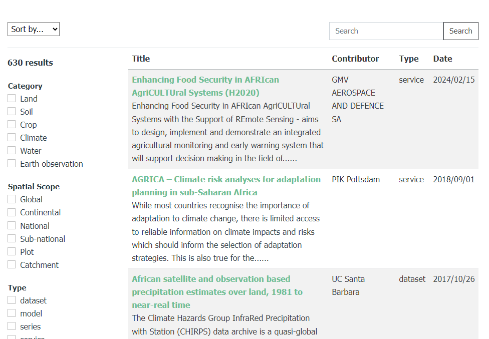
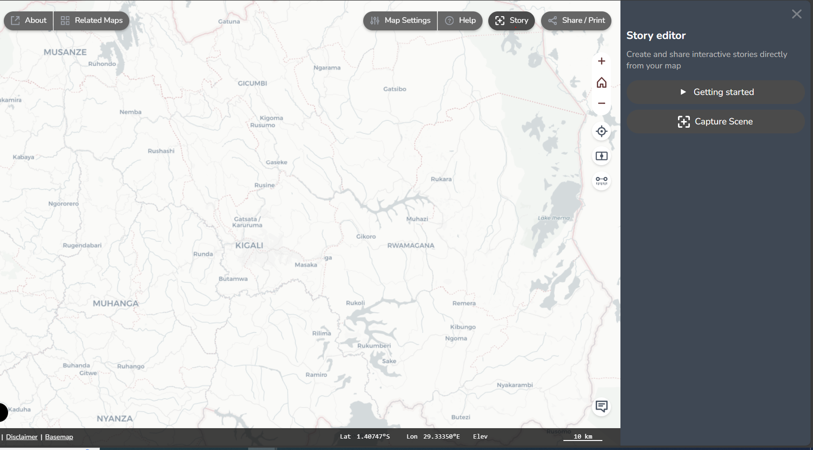
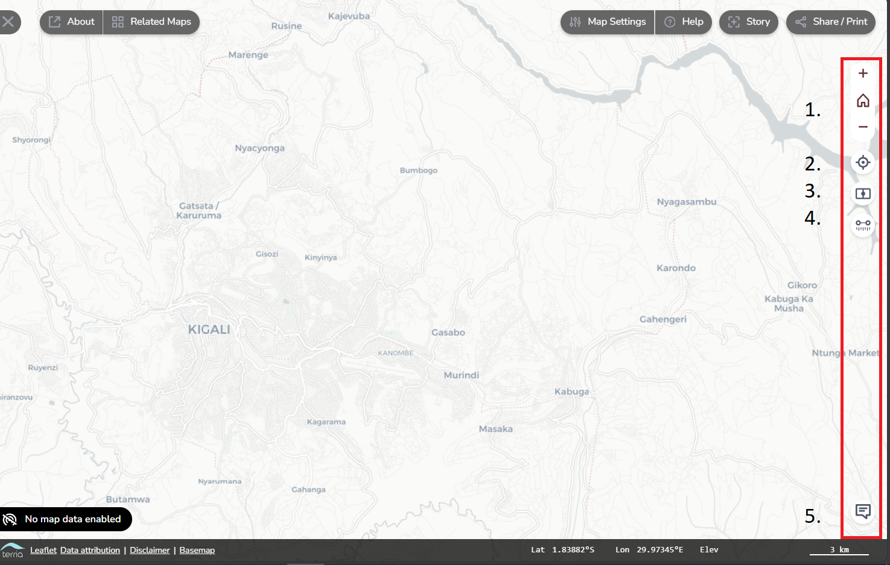
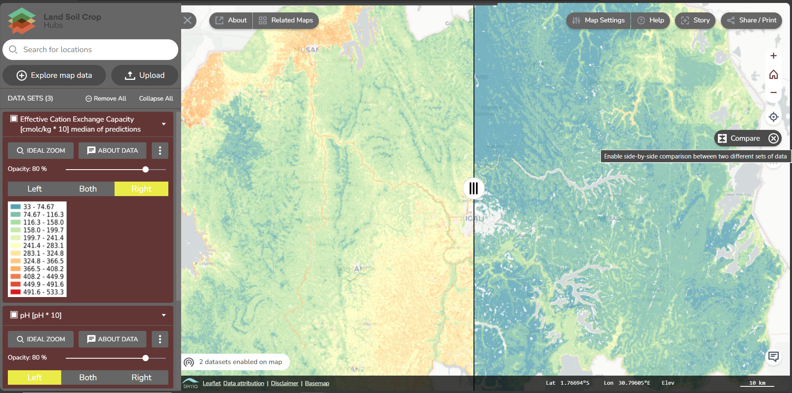
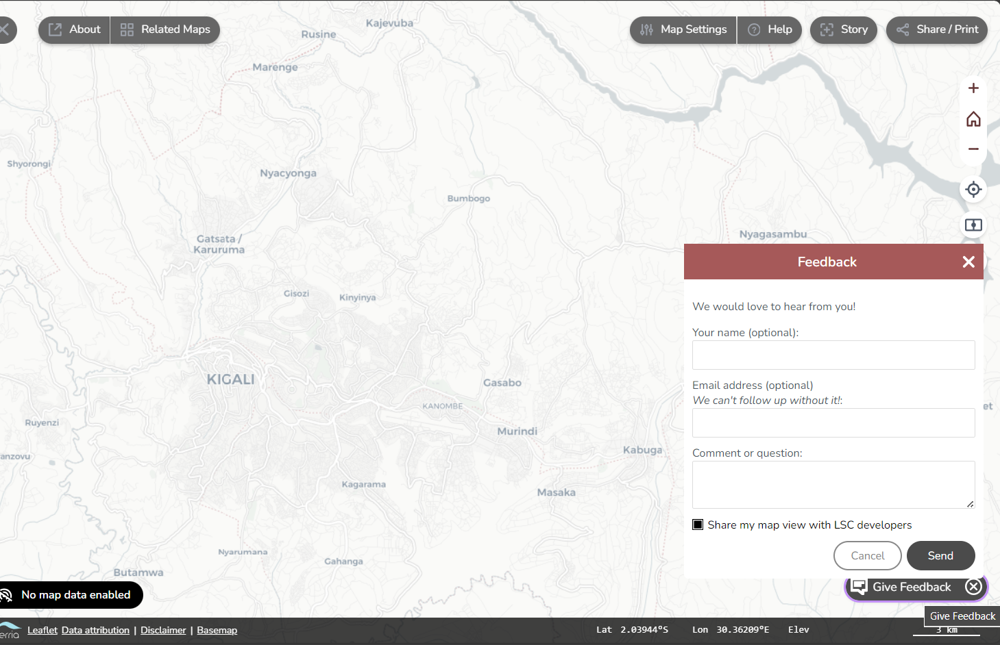
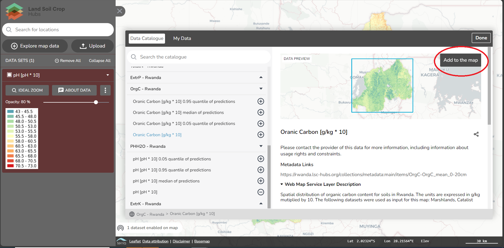
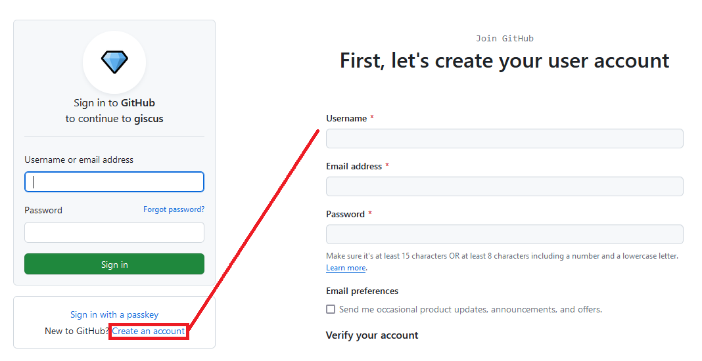
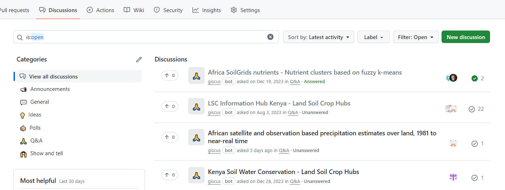

This document is a guideline for the components of a LSC Hub.

A typical LSC hub consists of 3 components:

- A [homepage](#homepage) providing a user welcome, project attribution and documentation; 
- A [catalogue](#catalogue) which provides a search interface on the resources relevant to the hub;
- A [map viewer](#map-viewer) section for easy access to data.

Moreover, there are 2 services important for the LSC hub:
- Providing [feedback](#feedback) to improve the LSC-hub
- Providing [Additional information](#additionalinformation) to enrich the LSC-hub.

## Homepage

The entry point of the hub is a webpage with general information about the project.
The LSC-hub for Rwanda can be accessed at https://lsc-hubs.org/hubs/rwanda/.

When arriving on the homepage, you can see 6 sections:
- **Data** to find data in the [catalogue](https://rwanda.lsc-hubs.org/) or go to the [mapviewer](https://maps.lsc-hubs.org/#lsc-rwanda)
- **Predictive modelling** to find modelling software in the [hub catalogue](https://rwanda.lsc-hubs.org/collections/metadata:main/items?type=model).
- **Policy** Which [policies](https://lsc-hubs.org/hubs/rwanda/policy/) are relevant to the hub, and can the hub support policy development?
- **Information Services** to find [agricultural knowledge and innovation systems](https://lsc-hubs.org/hubs/rwanda/akis/) in Rwanda
- **Use Cases** to explore the [use cases](https://lsc-hubs.org/hubs/rwanda/usecases/) of the LSC hub
- **Hub community** to find other users in the [stakeholder list](https://lsc-hubs.org/hubs/rwanda/stakeholders/)

**Exercise 1:** Explore the homepage of the LSC hub. Click on the links and explore which info is in there.

## Catalogue

The central catalogue contains references to all relevant resources in the hub. 
The catalogue of Rwanda can be reached by clicking under _DATA_ on _Catalogue_ or directly by https://rwanda.lsc-hubs.org/ 

When you click on submit, the available records will appear.

Resources are categorised into:

- Datasets
- Software 
- Model
- Services (Web services, APIs, SMS, phone and onsite services)

The catalogue allows the filtering of keywords. The 3 main keywords are: 
1. category ( _such as soil, crop, etc._),
2. spatial scope (_such as Global, National, district, etc._ ),
3. the type (_such as dataset, software, etc_).

Second, any other keyword linked to the resource can be used to search in the catalogue, for example, _land use_ or _crop yield_. This depends on which keywords are given to the resources.

**Exercise 2:** Try the keywords. Type in the search bar various keywords, such as _soil or Land use_ or click on the keywords on the side.

For each record, a number of metadata properties are provided, such as abstract, used datasets, keywords, usage constraints, and contact information.

Some records link directly to the [map viewer](#map-viewer) component. Under the image, it will say: Open _record_ in the LSC map and you will be directed to the map viewer.

**Exercise 3:** Explore the records. Click, after searching on keywords, on one of the appeared records and explore the provided information. Click on the links in the records

 

## Map viewer
Spatial data can be viewed and compared in a web-based map viewer. The map viewer can be accessed on the homepage of the LSC hub, under _DATA_ and then click on _Go the map viewer_.
The map viewer can also directly be accessed at https://maps.lsc-hubs.org/#lsc-rwanda 

The map viewer can used for the visualisation of existing maps listed in the LSC catalogue, your data and web data. In this guideline, we will take you through the available functionalities of the map viewer.

### Top menu

1. Get more information `about` the map viewer. The introduction, disclaimer and data attributes are described.
2. the `related maps` show other available maps, such as the LSC Ethiopia, LSC Keny and LSC Rwanda. If you click on one of these maps, it will zoom to those locations.
 

3. `Map settings` allows you to select a different base map, such as natural earth maps or aerial maps. This depends on which base map you prefer to work with.
 
  
4. `Help` gives useful tips on how to use the map viewer. It provides a tour through the map viewer and a step-by-step guide. This is an interactive guideline and shows the main functionalities.
 
  
5. A `Story` is a function that allows you to create and share interactive stories directly from your map. It contains a video with an explanation of how to create them.
 
  
6. `Share/Print` generates a link to your created map, which you can share with colleagues. Anything you have added to the map viewer will be shown in the shareable link.
      You can also use this button to download your created map as an image.   
 

### Vertical toolbar on the top right

The vertical toolbar allows you to zoom on the map or location, compare maps, measure distance and provide feedback. Each of the buttons will be explained below.

  

1. Zoom in and out, and back to a full world zoom
2. Zoom to your current location
3. Compare two map data side-by-side. In the next section on _explore map data_, we go into more detail on this function.
 

4. Measure the distance on the map between two locations.
 
  
5. Provide feedback on the map viewer. Feedback is essential to improve the map viewer and to ensure that the map viewer fits the user's needs. If you have any feedback on the map viewer, you can give it by this button.
 

**Exercise 4:** Explore the basic settings of the mapviewer. Change the map settings, take the tour at the help button, download your current map, measure distances and go to your location.

### The Sidebar

The sidebar is the main location for adding maps to the map viewer and visualising your data or any other web data.

   - `Search for locations` allows you to search for a specific location and go to your area of interest.
     
     
   - `Explore map data` shows a listing of datasets that can be added to the map via a catalogue search or directly from available maps. If the panel is empty, select an alternative map from `related maps`.
      

     Under the available maps, you can click on a property map to which you would like to add the viewer. It shows, for example, for the property pH, 4 maps: the 5% prediction value, the 95% prediction value, the median of predictions and the pH map.
     The values are given for pH*10 for better visualisation. Under the data preview, the metadata of the map is given. You can add the map to the map viewer by clicking on `Add to the map`.
     

     You can add as many maps to the Mapviewer as you want. For example, you add another map of Organic Carbon.
     

     If you now click on the `compare` button as described in the previous section, and put one layer to the left and the other to the right, you can compare the layers side-by-side.
     

     `About data` brings you back to the Explore map Data, and shows you the metadata describing the map. The description gives in addition which datasets are used to generate the maps.
   
   - `Upload` provides the option to open a dataset from the local computer. Note that this data is not uploaded to a server, so this data is not shared with anyone else. You can also add `web data` from this panel to the map viewer.
     

     For local files, you first need to select a file type. The file should have a spatial component and/or coordinates to add it to the map viewer. In step 2, you browse your file on your local computer.
     

     For web data, you first need to select the file or web service type. In step 2, you will add the URL to add the web data. For example, you can add the ESA land cover map as a WMS layer. The URL is:
     https://worldcover2020.esa.int/geoserver/gwc/service/wms?SERVICE=WMS&VERSION=1.1.1

     You can compare these maps with other added maps, through the compare button.
       

    
   - As soon as layers are loaded on the map, you can set the order of the layers, view a legend of the layer, zoom to its extent, set its opacity and view the metadata of the data. 

**Exercise 5:** The steps of this exercise are written down under the `help` button. By clicking on `Take the tour`, it will guide you through the steps.
1. Search for a location to quickly find an area of interest
2. Use 'Explore map data' to view the catalogue of available data sets and add at least two to the map
3. Interact with the data layer, including opacity and toggling on and off on the left in your workbench, compare the maps by using the compare button
4. Click on the data on the map to view more detailed data, including the raw data
5. Change your base map using options in 'Map Settings' to help make some data sets more visible
6. Zoom and change your view, including tilting the view angle using the controls on the right-hand side of the screen

## Feedback to LSC hub

Getting feedback from various stakeholders is crucial for several reasons. 
  1. Firstly, incorporating diverse perspectives from stakeholders involved in working with and benefiting from land, soil, and crop information ensures that the LSC hub caters to the actual needs and demands of its users (Data providers/Users). This feedback allows for the fine-tuning of the hub's functionalities, making it more user-friendly and effective in serving the specific requirements of different user groups.
  
  3. Secondly, gathering feedback facilitates continuous improvement. It provides an opportunity to identify potential shortcomings or areas needing enhancement within the LSC hubs. Insights from stakeholders enable the developers and administrators of the hub to address any challenges faced by users, thereby refining the system to better align with the expectations and requirements of its intended beneficiaries.
  
  4. Moreover, involving stakeholders in providing feedback fosters a sense of ownership and collaboration. When users feel heard and their inputs valued, it encourages their active participation and engagement with the LSC hub. This collaborative approach promotes a sense of ownership among stakeholders, leading to increased utilization and sustained support for the system in the long term.
  
  5. Ultimately, the feedback obtained from diverse stakeholders during the Rwanda WP4 workshop plays a pivotal role in ensuring that the LSC hub evolves as a valuable, user-centric platform, effectively supporting decision-making processes related to land, soil, and crop information in Rwanda's agricultural landscape.

Every page or resource on the hub provides an option to provide feedback and/or ask a question related to the content. In these sections, you can provide feedback about the page and what you would like to be adjusted.
  

Contributions to the hub require a [Github login](https://github.com/signup?ref_cta=Sign+up). A GIThub account is easily made by pressing on _sign in with GIThub_, then click on _New to GIThub? Create an account_. 
You only need to decide on a username, and password and enter your email address. 
  

Once logged in, you can now comment below the pages. If you have an account, You can provide feedback by contributing to hub discussions at the [github repository](https://github.com/lsc-hubs/rwanda-hub/discussions). To get started, you can create a new discussion.
  

**Exercise 5:** Create a GIThub account and start a discussion at the GIThub repository.

## Additional information
The catalogue can be linked to various information sources, without the data being stored on the LSC hub. Therefore, if you know existing information sources that are missing and should be added, there is a way to add the information by using an ODK form.

An Open Data Kit (ODK) form is a form that provides a structured way to collect and provide information. Typically forms are used by data collectors via an online link. The LSC-hub ODK form can accessed by: [ODK form LSC-IS](https://odk.isric.org/-/single/n2Sosp1gxbXLUcOelRBWsMru72DSLFb?st=pi9NCIyCBZIeYuVU0lb812NtQfOucM34dS04qF6GFaao2FB!c3DJDl10TTRTeOUJ)

  

The questions in the ODK form are a guideline to provide details (metadata) on your data/information/website/etc. that you would like to add to the LSC hub. Proving metadata is essential to avoid ambiguity. 

**Exercise 6:** Go through the ODK form, see if all questions are clear and try to fill in the ODK form for a website or data portal that is supplementary to the LSC hub.
