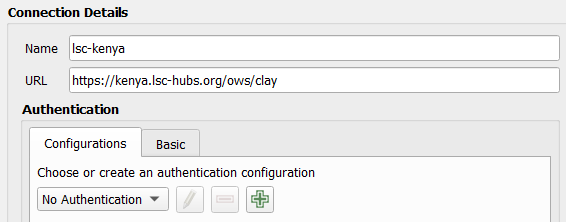
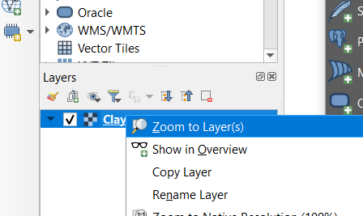

[QGIS](https://qgis.org) is an open source desktop GIS application available for Windows, MacOX, Linux and Android. It supports a wide variety of spatial formats, spatial data services, digitisation tools and spatial processing tools. If you are not familiar with QGIS, follow the [getting started tutorial](https://qgis.org/en/site/forusers/) first.  

## Visualize data using OGC:WMS

[OGC:WMS](https://www.ogc.org/standard/wms/) visualizes data in a mapviewer. To display a WMS in QGIS, Select from the menu `Layer > Add Layer > Add WMS/WMTS Layer`. This opens the Add layer panel. 

{.w-50 .border .shadow}

First we are adding a new service. Select the `New` button.

{.w-50 .border .shadow}

With the service selected, click the connect button and the layers available in the service are displayed

{.w-50 .border .shadow}

Select the relevant layer and click `Add` at the bottom of the panel. The Layer is now displayed on the map. If you don't see it yet, right click the layer on the table of content and select `Zoom to layer`.

{.w-50 .border .shadow}

Understand that you can not select features, because the interaction with the service is based on images. You can however use the `i` tool to retrieve attribute information from pixels. A dedicated method on the service, called 'getFeatureInfo' is used.

## Visualize and download vector data using OGC:WFS or OGCAPI:Features

[OGC:WFS](https://www.ogc.org/standard/wfs) retrieves vector features from a dataset. [OGCAPI:Features](https://ogcapi.ogc.org/features/) is a modern alternative to WFS, supported by some servers. Adding a WFS or Features layer to QGIS uses a similar procedure as adding a WMS layer. Select `Layer > Add layer > Add WFS layer` from the menu. Notice that only vector layers are shown, grid layers use the WCS protocol (see next paragraph).

{.w-50 .border .shadow}

Notice the `build query` button in the footer of the panel. This allows you to filter features on attribute value, for example `pH < 5`. Substantially less data will be retrieved, improving the performance.

With the layer added to the view, notice that the data has no styling, it acts as any other vector dataset. You can select features and even open the attribute table. 

To extract a subset of the data, zoom to the area of interes, then right click the layer in the table of contents and select `Export > Save Features As`. 

{.w-50 .border .shadow}

On the export panel, set the format, a file location and set the extent (current). Then select `OK`.

## Visualize and download grid data using OGC:WCS

[OGC:WCS](https://www.ogc.org/standard/wcs) retrieves subsets from a grid dataset. Adding a WCS layer to QGIS uses a similar procedure as adding a WFS layer. Select `Layer > Add layer > Add WCS layer` from the menu. 

The WCS layer acts like any grid layer, you can retrieve the pixel value and run grid processes on the layer.

Exporting a grid for a region of interest works similar as WFS.

## Visualize and download observation data using Sensorthings API

Soil observation data is best made available through [Sensorthings API](https://www.ogc.org/standard/sensorthings/). Sensorthings API is not a default supported format of QGIS. You need to install the [Sensorthings Plugin](https://github.com/AirBreak-UIA/SensorThingsAPI_QGIS-plugin).

With the plugin installed, you can add a layer of type Sensortings via `Layer > Add layer > Upload layer from remote server`. Use for example the [service of 
Comune di Ferrara, Italy](https://iot.comune.fe.it/FROST-Server/v1.1/Locations). As soon as the sensor locations show on the map, you can select 'Show location information' tool from the plugin menu and select a sensor. And view or download the observations at that location.

{.w-50 .border .shadow}

